

<h1 style="margin-bottom: 0;">Cyclops:</h1>
<h2>A Tool for Visualizing and Analyzing Data</h2>

### Motivation

In my current job, I'm the sole developer/ops person for a small website. Even though the site is relatively simple and doesn't get a ton of traffic, it emits a good amount of data, in the form of logs, front- and back-end events, reports, and database tables (note: I'm talking about usage data here, not data about the infrastructure of the site i.e. resource usage over time).  I currently use a mish-mash of tools to deal with coalescing and analyzing this data: Mixpanel for events, Papertrail for logs, Adminium for some database stuff, and then lots of hand-rolled code to generate reports and dashboards. Additionally, I'm often handed CSV files that I need to clean up and cross-reference with existing site data. 

While my current solutions are OK, they're limiting in some key ways:

- The kind of analysis I can do is severely limited. Because I can't easily cross-reference data from different sources, the kinds of questions I can ask are pretty restricted.
- Actually writing analytical reports is a really annoying process. Not having real-time feedback on the job I'm writing and the results it might produce make the process much more time-intensive and error-prone.
- Because the site is currently small, using hacky tools works. However, as the site scales up, I'm dreading the prospect of having to migrate everything to some other platform.
- Specifying dependencies between or variations of individual reports is extremely difficult, and I've solved the problems I've encountered in extremely inelegant ways

I explored some existing "business intelligence" products, but they fell short on a few dimensions:

- All of the tools that I found were built for less technical people. I was looking for something that was closer to an IDE than to a out-of-the-box solution.
- To that end, the kinds of transformations and explorations that I need to do were not well supported. Most just offer SQL as the way to manipulate data.
- They were not geared towards ingesting stream-like data (logs, events).
- Price and "enterprise-yness". Seriously! I couldn't actually play around with most of the things I was interested in. They also cost a bajillion dollars.
- [Hue](http://gethue.com/) is *so close* to what I was looking for, but unfortunately it's very confusing and poorly designed. It's also hard to get up and running quickly.

### What I Want

I want a **Heroku for data**. In the same way that Heroku takes raw computing resources and packages them together into a highly-abstracted, easy-to-use, easy-to-scale platform, I want a system that does the same for the usage data that my site produces. Additionally, I want a system that makes no mentions of clusters, jobs, or pipelines. All of the "big data" stuff should be abstracted away.

In terms of capabilities, I want a product that makes it very easy to:

- **Explore and visualize data**: I want to be able to use a language that's more powerful and flexible than SQL, but still geared towards manipulated relational data. I want a real-time view of the data flowing through the script. I want to be able to modify part of a script without rerunning the entire script. I want to be able to use any output or intermediary result of a script as the input to another script. I want to be able to programmatically visualize data, and have my visualizations update in real time if I modify my script. 
- **Get data in**: I want it to ingest all of my database tables, logs, events, external API results, and arbitrary CSV file uploads. No dealing with Sqoop, or S3, or anything like that. I want to hook it up to my app once and have it stay in sync forever.
- **Get data out**: I want the results of all my analyses and explorations to be easily accessible to everyone on my team. The system should provide non-technical team members with an interface that allows them to view visualizations, download reports, and query the resulting datasets. I also want all of the data this system generates to be exposed as API endpoints that I can hit from other systems. I also want all of the outputs of the system to stay relatively up-to-date without me having to do anything. 

### What I'm Envisioning

I took a whack at envisioning what an ideal product would look like for me, based on the above criteria. I've nicknamed it Cyclops.

I broke up the interface into three sections: **sources**, **flows**, and **outputs**. **Sources** are anything that Cyclops can ingest - database tables, logs, events, APIs, or arbitrary CSV uploads. **Flows** are Cyclops' mechanism for allowing users to explore, manipulate, and visualize data. **Outputs** are the results of flows, which might be computed relations or visualizations.

We'll start with the sources. Here we see that a database has already been added to Cyclops. Syncing a database should be dead simple - paste in a JDBC connection string, and all of the data and schemas for that DB get sucked in (and stay synced forever). 

<a href="images/full/databases.png">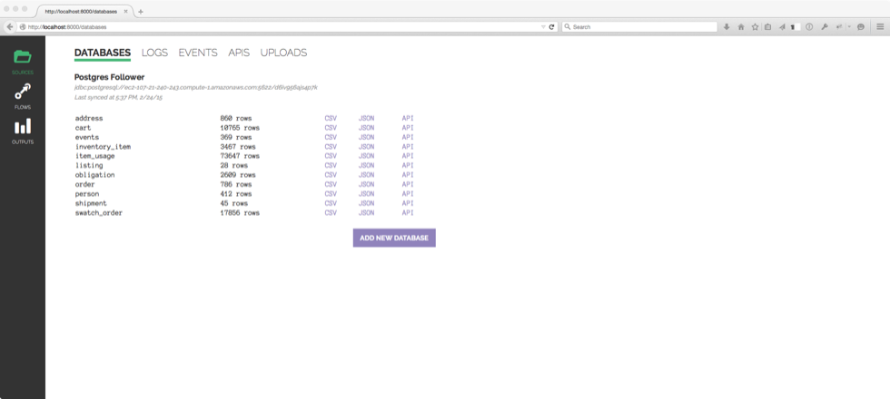</a>

Adding logs should be similarly easy. Just add a syslog drain to your app, and Cyclops would start aggregating your logs.

<a href="images/full/logs.png">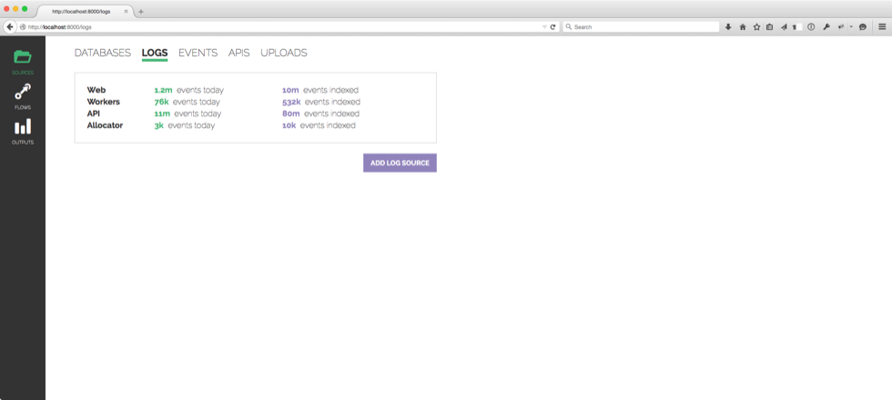</a>

I didn't mock up events or APIs, but they would ideally be similarly simple. For events, I would imagine being able to POST to an arbitrary endpoint to record information from the front- or back-end of the site. The user could also add arbitrary API endpoints who results would be ingested at regular intervals.

Having hooked up some data sources, we'll now move over the flow builder:

<a href="images/full/flows.png">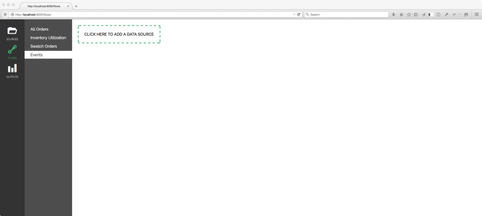</a>

On the left-hand side is a list of flows I've already made. We're now looking at a new, blank flow. Clicking the "add a data source" box brings up this dialog:

<a href="images/full/choose-source.png">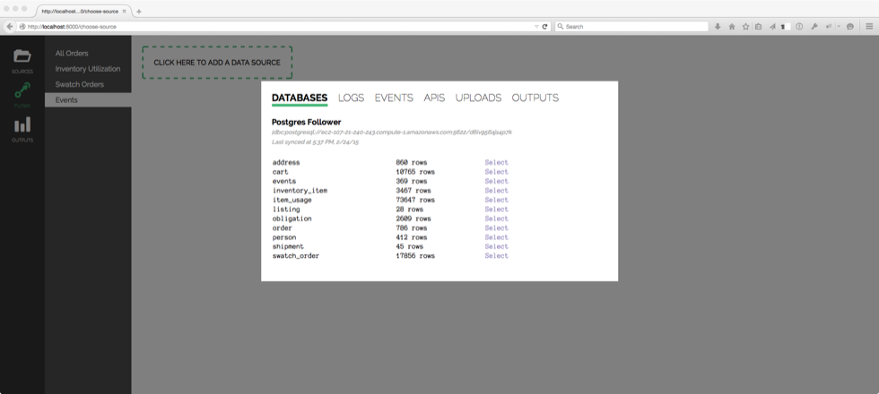</a>

It shows all of the sources we saw in the previous section. Note, however, the additional tab labeled outputs. We're able to use the output of any flow as the input to any other flow.

Let's say we select the `events` table. We see it appear in our flow:

<a href="images/full/source-chosen.png">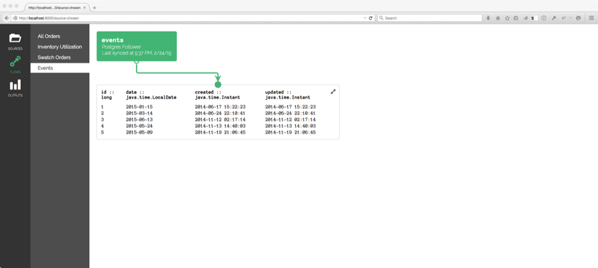</a>

There it is! We see the source itself (the green box), as well as a preview of the data flowing out of the source. If we click on the icon in the upper right of the data preview, we can take some actions on that relation:

<a href="images/full/relation-actions.png">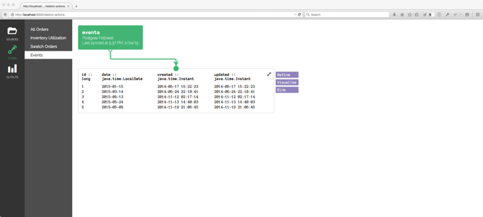</a>

There are three actions available:

- **Refine**: we can take the relation and (non-destructively) filter, sort, group, or transform it in some way
- **Visualize**: we can turn the data into a pretty picture
- **Sink**: we can indicate that this relation is one that we want too access from outside the flow - either from another flow, or from the outside world (as a report or whatever)

Let's say we choose to **refine** that relation. We see something like this:

<a href="images/full/refine.png">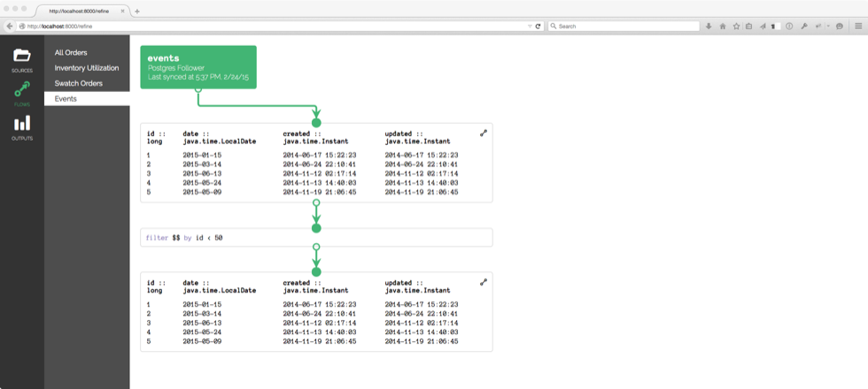</a>

Now we see that our initial relation passes through a code chunklet, and a new relation is produced (the code chunklet shown is a Pig statement). We can also modify the code chunklet, and the relation that results from that chunklet will update in real time, without affecting any other part of the flow.

One cool thing about constructing flows in a visual way like this is that it becomes easy to reason about sending a relation through multiple different refinements:

<a href="images/full/multi-refine.png">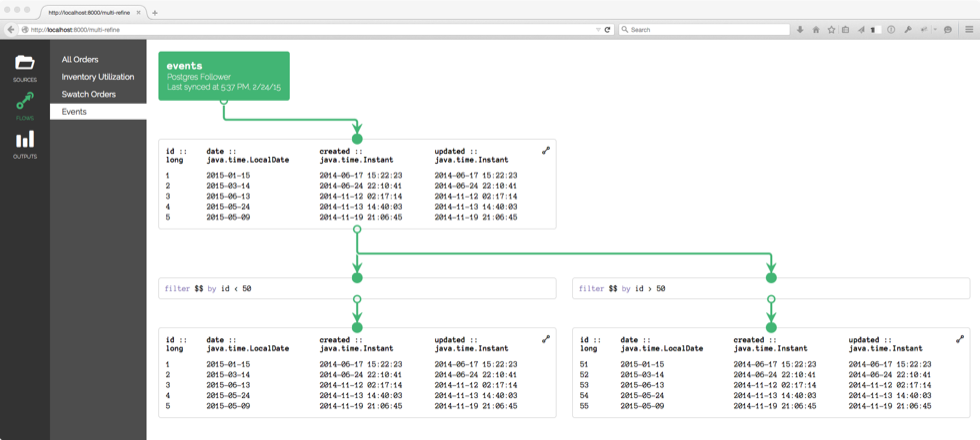</a>

Pretty cool, huh?

If we choose to **visualize** the relation, we see something like this:

<a href="images/full/visualize.png">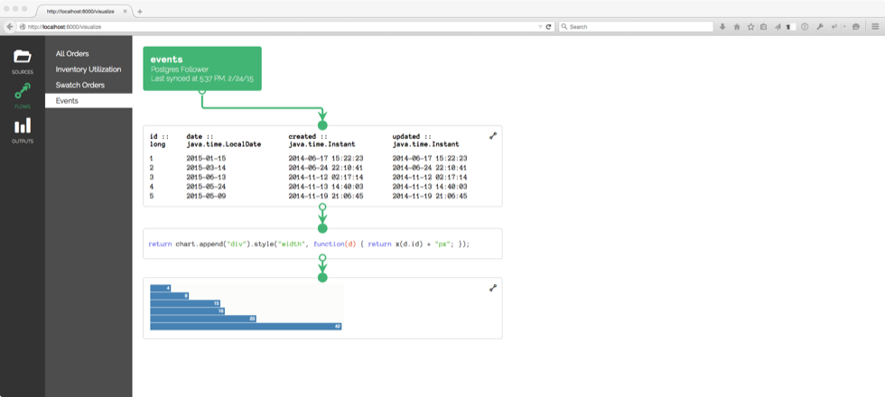</a>

The relation is again passing through a code chunklet, but in this case a picture is produced, as opposed to a new relation. The code shown above is Javascript and D3. The resulting visualization can be sinked (sunk?) just like relations can, which makes it accessible to the outside world.

The final part of the interface is the outputs:
 

<a href="images/full/outputs.png">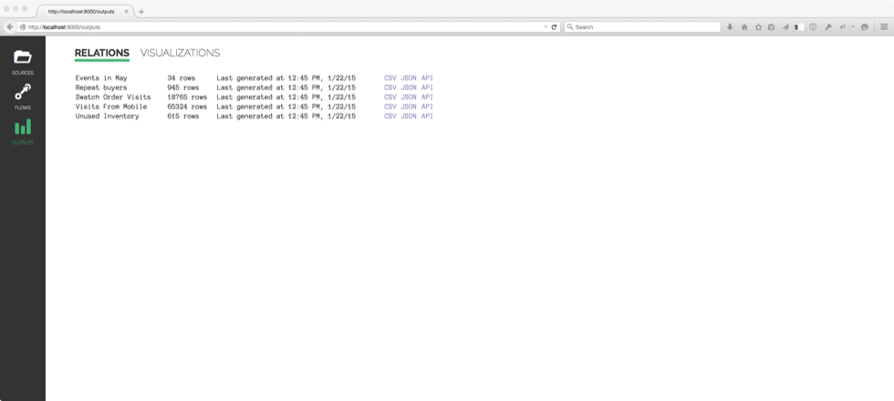</a>

Here we can see all of the relations we've sinked. You'll see that each relation has links to download a CSV or JSON file of the data within, or access the data via an API endpoint. Sinked visualizations follow a similar pattern:

<a href="images/full/visualization-output.png">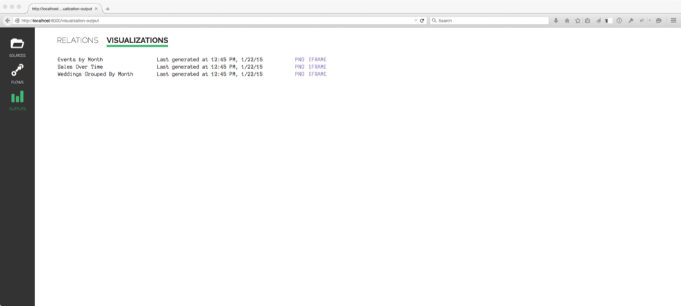</a>

And that's all I've got!

### Unexplored Territory

This is only a cursory exploration of what such a system might look like. There are a bunch of things that I haven't given much thought to:

- Joins between data sources
- Parameterized statements/jobs
- Utilizing user-defined functions
- Data schemas + pipeline validation
- Making huge, super-complex flows (might be difficult to do in a visual manner)
- The interface that non-technical people could use to get reports and see visualizations

However, even though this is preliminary, I have built a (very ugly) prototype that allows me to suck in a big CSV and build flows around it, using Pig and D3. I don't know if it scales, but I like using it (I actually use it today for day to day work), so that's something!