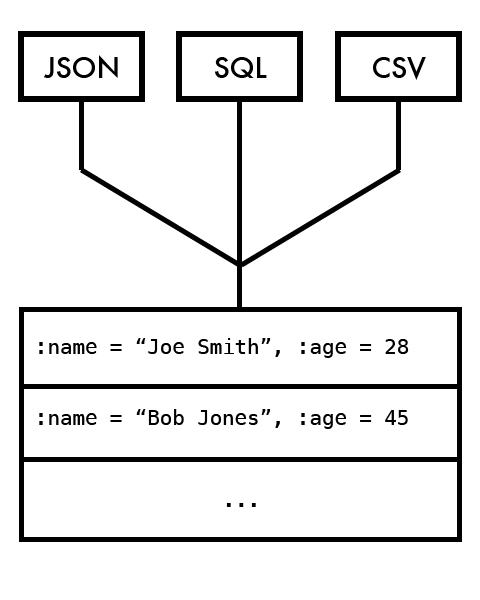
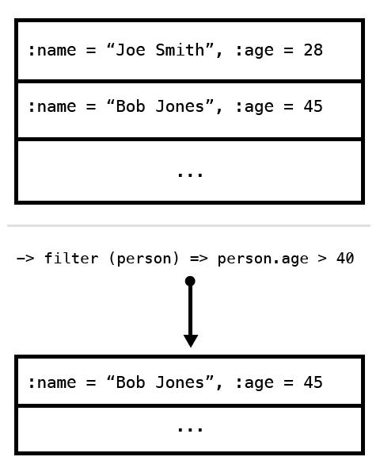
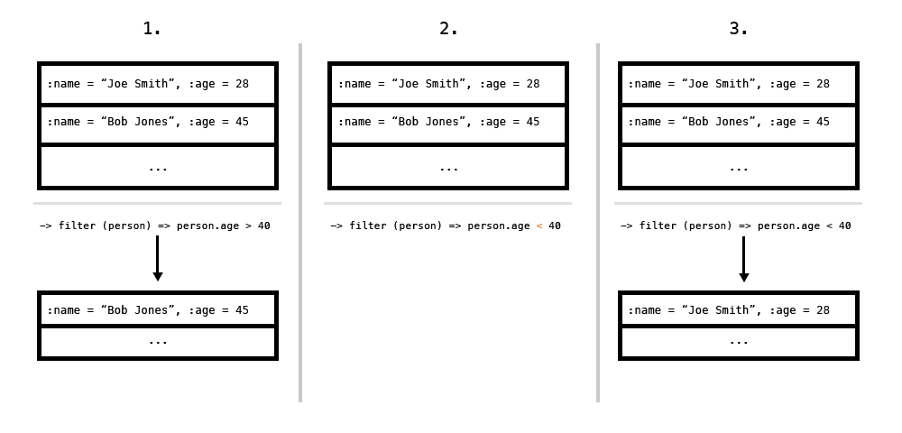
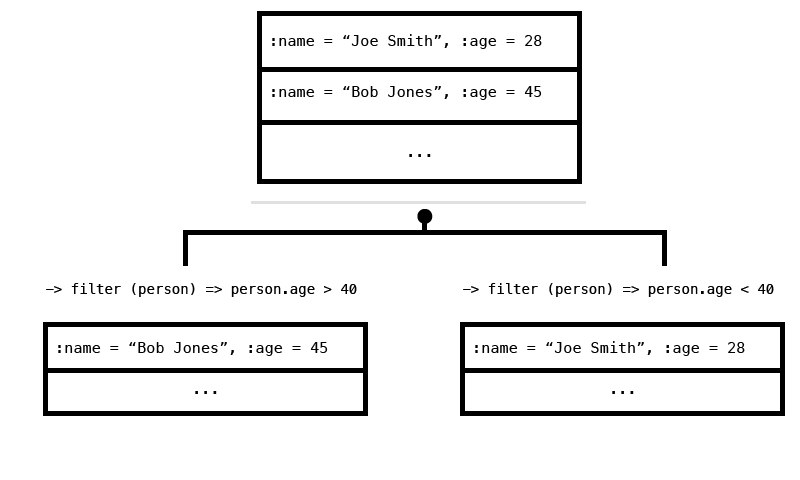
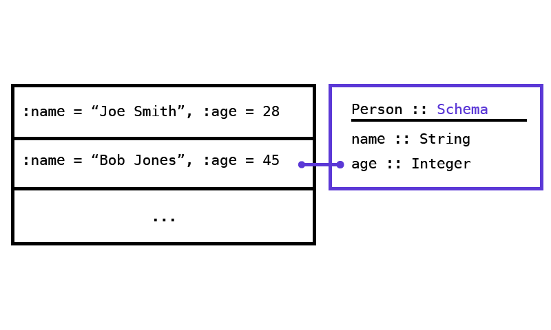
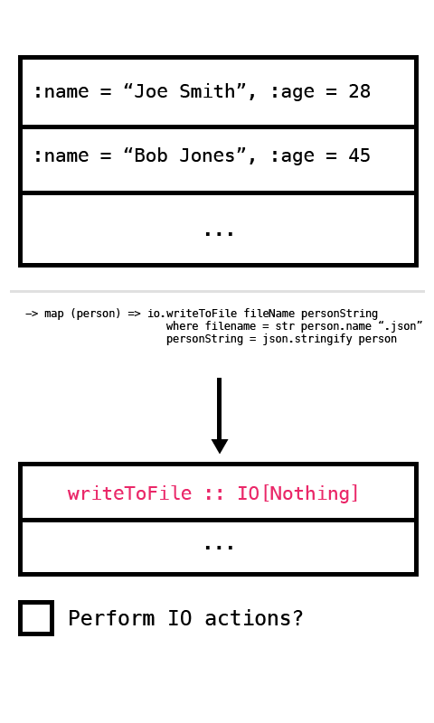
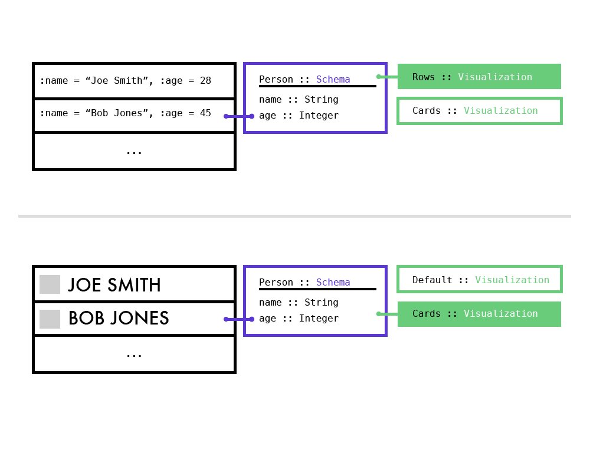

###What it Stepwise?

Stepwise is a tool for working with data. Stepwise makes it easy to transform, analyze, and visualize large quantities of data in an interactive, visual, and non-destructive fashion. Stepwise is like a combination of a REPL, a spreadsheet, and a full-fledged programming environment.

###How does it work?

Stepwise works like this: first, you tell it which sets of data you want to work with. Stepwise knows how to work with lots of different sources of data: CSV files, JSON data from APIs, SQL databases, or just regular text files:

Once Stepwise is hooked up to your data sources, you create a *pipeline*: a sequence of transformations on that data:

Some examples of transformations you might do on a data set are:

- Filtering the data set by some criteria
- Selecting out a few of the fields included in the data set
- Applying some function to each item in the data set
- Joining the data set together with another

Each step in the pipeline operates on the data **non-destructively**. So, when you apply a transformation to a data set, the original data set is unaffected. Instead, the result of the transformation is a completely new data set. Additionally, if you modify a transformation that was applied in an early step of a pipeline, all of the transformations "downstream" of that one get recomputed:

You can also "branch" the flow of data, which is the equivalent of creating an "alternative universe" for your data, in case you want to try a few different analyses:

###Schemas

Stepwise is really concerned with the "shape" of data. Knowing the shape of the data flowing through a pipeline allows Stepwise to make smart suggestions and ensure that all the pieces of a given pipeline connect to each other correctly. To this end, Stepwise allows you to make *schemas*, which are lightweight, flexible ways of describing the shape that a set of data should have:

Once you've defined a schema, Stepwise is smart about knowing if a given data set conforms to that schema. In addition to ensuring that all parts of a given pipeline work together, schemas make it easy to build up a library of transformations, pipeline segments, and visualizations that can be applied with confidence to any project.

###The Stepwise Language

Stepwise contains a small programming language for describing data transformations. The language is specially designed for working with data, so operations akin to SQL's "join" and "group by" are built in, in addition to more functional transformations like "map" and "reduce". The Stepwise language also has an idea of functional purity, so it knows if a given operation affects the outside world. This is really useful when building pipelines of transformations, as Stepwise can be smart about not doing things like hammering a database when a set of transformations have to be recomputed:

###Visualizations

Stepwise also makes it easy to explore and interact with data visually. At each step in a pipeline, the result of the transformation is displayed back to you as a visualization. While the default visualization is rudimentary, Stepwise has a simple paradigm for defining new visualizations: you can define visualizations in the Stepwise language itself, and apply them to a dataset based on the schema(s) that it conforms to:

So, at each step in the pipeline, you can choose from a library of visualizations that apply to the resulting data set, based on the shape of that data.

###In Da Cloud

Lastly, Stepwise is designed to run on top of industrial-grade cloud computing infrastructures such as Amazon's AWS or Google's Cloud Compute Engine. This allows you to work with massive datasets, perform intensive transformations, and have results quickly. Additionally, Stepwise is smart about doing computations only when necessary, so making small tweaks to a pipeline means that you often only have to recalculate a portion of it (as opposed to having to rerun all of the computations involved).

###Beyond Data

While the Stepwise paradigms most obviously apply to working with data, the model actually works well in any scenario that would normally be taken care of with a one-off "script." For example, if you wanted to grab the contents of a website, parse its text, find all of the images, and save those images to your hard drive, Stepwise would be perfectly suited for the task. And unlike writing a small script in an existing language like Python, you'd be able to see the results at each step along the way, ensure that each piece of the pipeline worked correctly thanks to schemas, not do unnecessary IO work thanks to functional purity, not rerun computations unnecessarily as you tweaked the code, and run the whole thing in parallel across many machines in the cloud. It'd be faster to write, faster to run, and less error prone. Stepwise has the potential to be useful far beyond just doing data analysis.